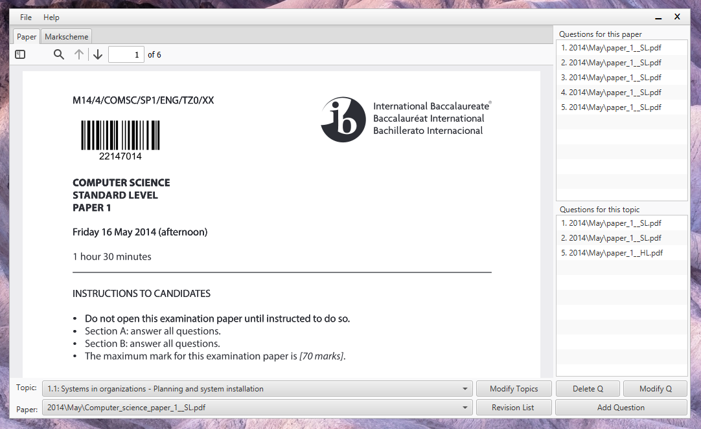
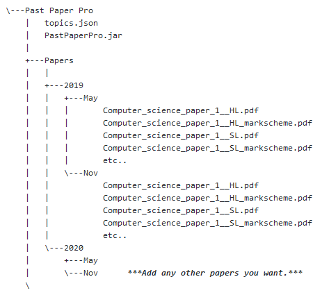

# PastPaperPro

## Table of Contents
* [General Info](#general-information)
* [Appreciation](#appreciation)
* [Technologies Used](#technologies-used)
* [Features](#features)
* [Screenshots](#screenshots)
* [Setup](#setup)
* [Usage](#usage)
* [Project Status](#project-status)
* [Room for Improvement](#room-for-improvement)
* [Contact](#contact)

## General Information
Past Paper Pro was created as a solution to the lack of paper/question management currently avaliable for the IB DP Computer Science programme. Although the IB promotes their own question bank via titleware, it isn't avaliable for Computer Science, and has a yearly subscription.

Past Paper Pro will hopefully make it easier for teachers of any subject to manage past papers for free!

IB Past papers are copyrighted and will not be shared here. This program relies on you having your own copies of past papers and placing them in the correct folder. See Setup and Usage. You can share your topics.json data which contains all the information about the IB Past papers that have been processed.

I will keep my Computer Science Json file here for anyone to use. If you would like to add a json file for another course, email it me and I'll add it.

## Appreciation
If this program was useful please send me a line (bluishmatt@gmail.com), I would love to hear how/where this is being used.
If it is super useful, you can also show your appreciation via Paypal at:

or buymeacoffee.com:

## Technologies Used
- Java 8

## Features
- Find all questions by topic with their markschemes.
- Get a revision list of topics in a paper.

## Screenshots

## Setup
This program uses a specific folder structure for the papers and has been tested with IB DP papers. 
Download the zipped file at the top of this page and extract it anywhere on your computer. If you don't want all the java files, the following is the minimum you need:

## Usage
The program stores data (paper, question number, location) about questions in topics.Json. This can be shared with anyone you like.

On the first run the program will need to convert all pdfs it can find into PNGs. 

**Adding / modifying topics**

If you are using this for a course that isn't Computer Science, you'll need to first create the topics of your course.
Click the modify topics button. Add topics as you please. The structure is Topic Number > Topic > Subtopic. If a topic doesn't have a subtopic, leave it blank. 

**Adding a new paper**

When adding a new paper into the folder structure it will be converted to PNG automatically the next time you start the program.
Once complete you will see the new paper in the list of past papers. Select the new paper and there will no questions created for it yet (unless someone shared their topic.json file with you.

**Adding a new question**

To add a new question to the paper, scroll to the question on the paper and markscheme tabs, click add question and fill in the information.

**Modifying a question**

If you want to correct a mistake, click the modify question button. From here you can change the question number, scroll to a new location and click update, or change/add/remove topics for the question.

## Project Status
Project is: _in progress_.

## Room for Improvement
- 

To do:
- Paper creator - Would be great to have the option of creating a new paper with a mixture of past paper questions. Could select/weight topics.

If you would like to request an improvement/feature, let me know. If you have any difficulties or problems I am also happy to help.

## Contact
Created by [Matt Elliot](bluishmatt@gmail.com) - feel free to contact me!
